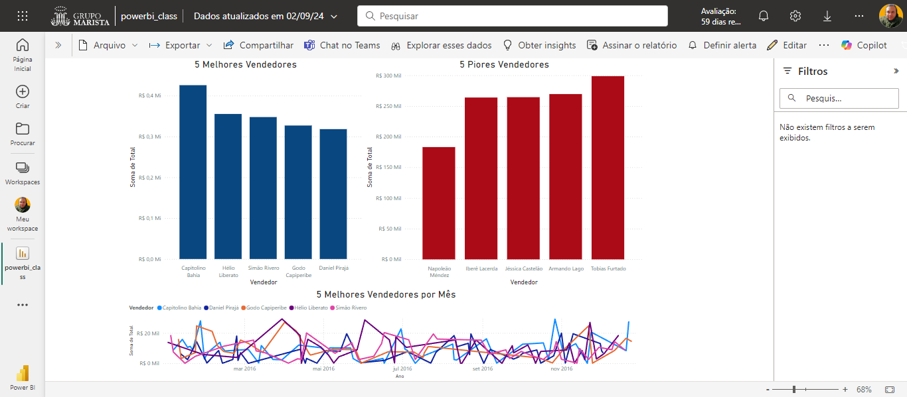

# Curso "Power BI para Todos"

> O que Eu Aprendi com o Curso "Power BI para Todos"

<!-- -->

Quero compartilhar com você um pouco do que aprendi no curso "Power BI para Todos: Fácil e Simples!".

&nbsp;

## Principais Aprendizados:

### Instalação e Configuração do Power BI:

Aprendi a instalar e configurar o Power BI no meu ambiente de trabalho, garantindo que tudo estivesse pronto para começar a explorar os dados.

### Importação de Dados:

Durante o curso, entendi como importar dados de diferentes fontes, o que é fundamental para analisar informações de diversas origens.

### Criação de Dashboards:

Uma das partes mais empolgantes foi aprender a construir dashboards interativos. Agora, consigo transformar dados brutos em visualizações claras e impactantes.

### Publicação de Dashboards:

Também aprendi como publicar esses dashboards, facilitando o compartilhamento de insights com outras pessoas.

### Estudo de Caso:

O curso incluiu um estudo de caso que me permitiu aplicar tudo o que aprendi em um cenário real, solidificando o conhecimento adquirido.

&nbsp;

&nbsp;

&nbsp;

&nbsp;

### Configuração para Dispositivos Móveis:

Além disso, aprendi a adaptar os dashboards para que possam ser acessados de forma eficiente em dispositivos móveis.

&nbsp;

&nbsp;

&nbsp;

&nbsp;

&nbsp;

## Conecte-se comigo nas redes sociais:

